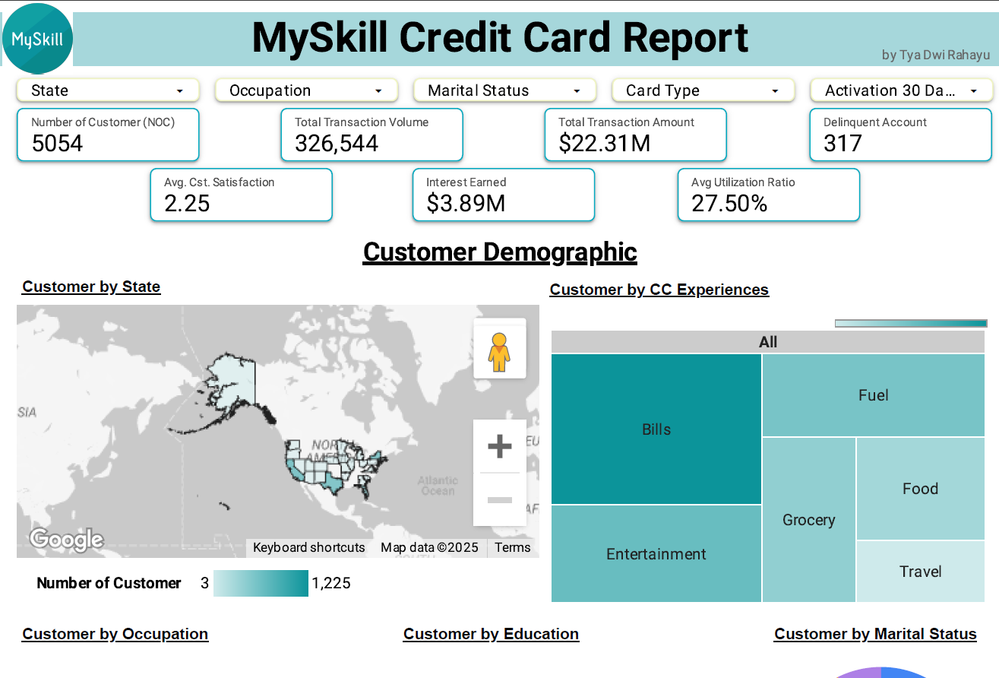
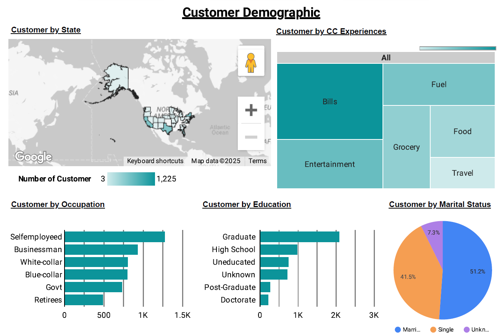
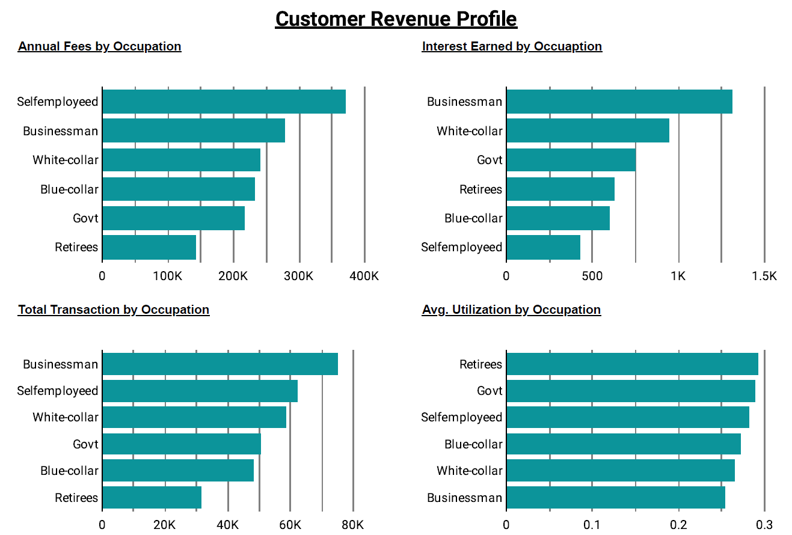
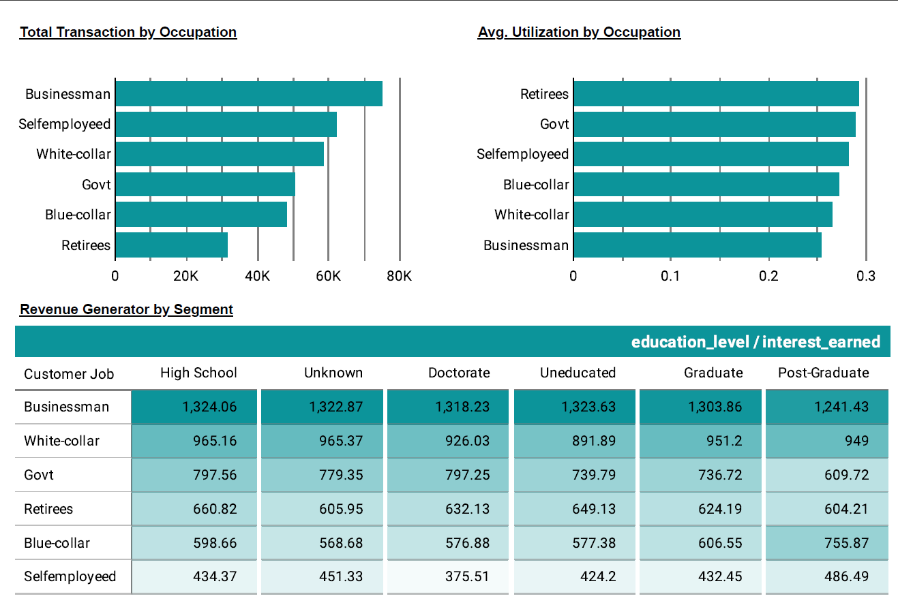
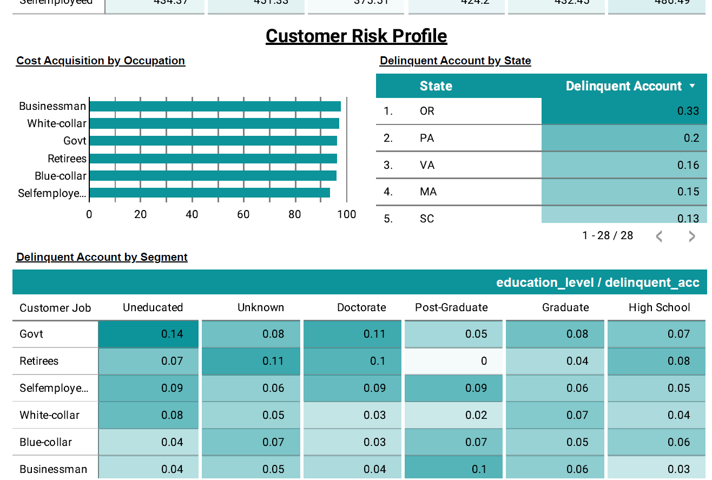

# 📊 MySkill Credit Card Report (Google Looker Studio)

Dashboard ini dibuat sebagai bagian dari program e-learning Data Analyst oleh MySkill.  
Proyek ini bertujuan untuk menganalisis data pelanggan kartu kredit dan memberikan insight berdasarkan demografi, transaksi, dan risiko kredit.

## 🎯 Tujuan Proyek

- Mengidentifikasi segmentasi pelanggan berdasarkan demografi dan profil keuangan.
- Menyajikan performa pelanggan dalam pembayaran, pendapatan, dan risiko kredit.
- Menggunakan Google Looker Studio untuk membuat dashboard interaktif.

## 🛠 Tools yang Digunakan

- Google Looker Studio
- Google Sheets (untuk sumber data)
- PDF & Visual asset (untuk dokumentasi dan laporan)

## 📌 Fitur Dashboard

- Customer Demographic Overview (State, Marital, Education, Occupation)
- Revenue Profile (Income, Total Transaction, Annual Fees)
- Risk Profile (Credit Score, Interest Earned, Delinquency)
- Visual interaktif: Filter berdasarkan State, Card Type, dll

## 🌐 Link Dashboard Online

🔗 [Lihat di Google Looker Studio](https://lookerstudio.google.com/reporting/9d3306ae-24e5-4448-801e-40d6acc86714)

## 🖼️ Cuplikan Dashboard

  Dashboard Overview
  
  Customer Demographic
  
  Customer Revenue Profile
  
  Customer Revenue Profile
  
  Customer Risk Profile
  

## 📄 File yang Disertakan

- `MySkill_Credit_Card_Report.pdf` – Laporan ringkasan dan insight visual
- `screenshot.png` – Tampilan dashboard dari Looker Studio

## 👩‍💻 Tentang Saya

Nama saya Tya Dwi Rahayu, seorang lulusan Fisika yang sedang membangun karier di bidang Data & IT.  
Saya terbuka untuk kolaborasi dan terus belajar untuk meningkatkan keterampilan di bidang data analysis.

---

📫 Silakan hubungi saya jika tertarik untuk diskusi atau kolaborasi proyek data lainnya!

